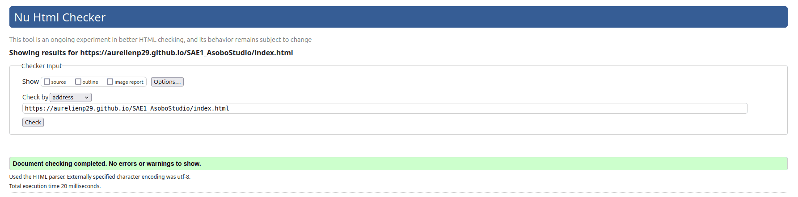
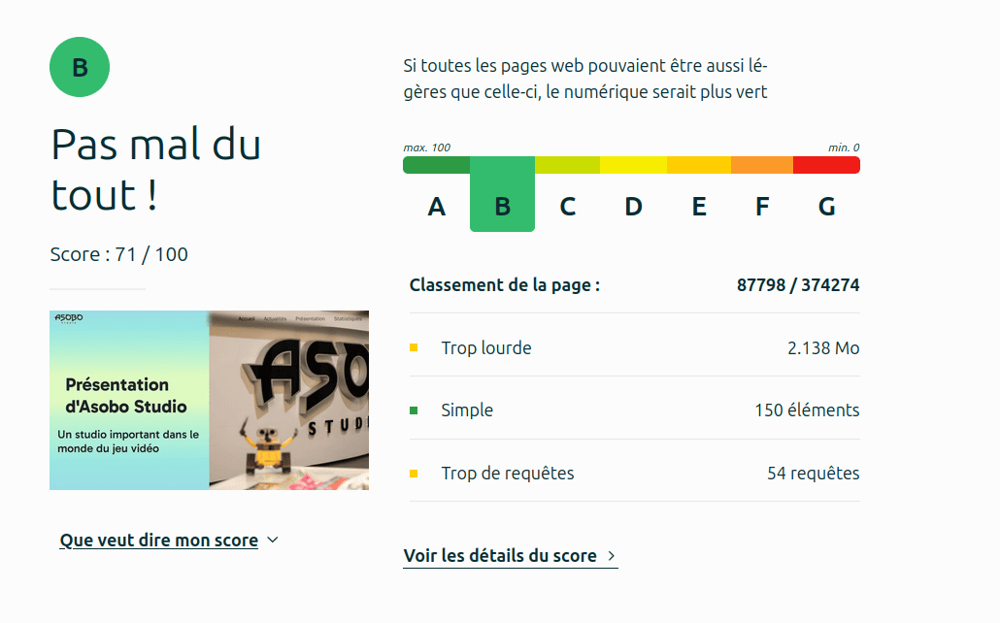

# Présentation d'AsoboStudio   

## Sujet    

Asobo Studio : [Lien vers le site](https://aurelienp29.github.io/SAE1_AsoboStudio/index.html)

## Membres du groupe :

Etudiant 1 (référent du groupe) :  [PAILLARD Aurélien](mailto:aurelien.paillard@edu.univ-fcomte.fr?subject=SAE_1_05_06)  
Etudiant 2 : [ROYER Thomas](mailto:thomas.royer@edu.univ-fcomte.fr?subject=SAE_1_05_06)   
Etudiant 3 : [OTTINGER Axel](mailto:axel.ottinger@edu.univ-fcomte.fr?subject=SAE_1_05_06)  
Etudiant 4 : [NGOM Ibrahima](mailto:ibrahima.ngom@edu.univ-fcomte.fr?subject=SAE_1_05_06)  

## Présentation du projet

Ce dépôt correspond à un site web créé en HTML/CSS/JS dans le cadre de la SAÉ 05-06 à l'IUT de Belfort-Montbéliard.

Ce site a pour objectif de présenter Asobo Studio, un acteur clé dans l'industrie du jeu vidéo.

À travers différentes pages, nous explorons l’histoire du studio, ses jeux marquants, ses innovations technologiques et son impact économique ainsi que les actualités récentes. 

Le but est de faire connaitre l'expertise unique d'Asobo et d’offrir aux visiteurs une vue d'ensemble de son évolution et de ses réalisations.

## Choix de conception  

Pour la conception du site, nous nous sommes grandement inspirés du site officiel de AsoboStudio (disponible [ici](https://www.asobostudio.com/)), et nous nous sommes inspiré du site de FlareDepartment comme référence (disponible [ici](https://flaredepartment.com/)).    

## Développement Site Web et Validation des pages

### Page d'accueil

**Auteur : PAILLARD Aurélien**  

Vérification W3C : [Détail ICI](https://validator.w3.org/nu/?doc=https%3A%2F%2Faurelienp29.github.io%2FSAE1_AsoboStudio%2Findex.html)

(Gros poid et beaucoup de requêtes à cause de la carte interactive)

### Page d'actualité

**Auteur : NGOM Ibrahima**  

Verification W3C : [Détail ICI](https://validator.w3.org/nu/?showsource=yes&showoutline=yes&showimagereport=yes&doc=https%3A%2F%2Fdemo-am90.github.io%2Fs1-demo%2Findex.html)

### Page de présentation

**Auteur : OTTINGER Axel**  

Verification W3C : [Détail ICI](https://validator.w3.org/nu/?showsource=yes&showoutline=yes&showimagereport=yes&doc=https%3A%2F%2Fdemo-am90.github.io%2Fs1-demo%2Findex.html)

### Page de statistiques

**Auteur : ROYER Thomas**  

Verification W3C : [Détail ICI](https://validator.w3.org/nu/?showsource=yes&showoutline=yes&showimagereport=yes&doc=https%3A%2F%2Fdemo-am90.github.io%2Fs1-demo%2Findex.html)

## Répartition du travail

### Planification - Diagramme de GANTT

- PAILLARD Aurélien

### Recherches d'informations

- ROYER Thomas
- OTTINGER Axel
- NGOM Ibrahima

### Rapport économique

- PAILLARD Aurélien
- ROYER Thomas
- OTTINGER Axel
- NGOM Ibrahima

### Développement site

- PAILLARD Aurélien
  - Page d’accueil
  - "Template" de page (Navbar/Footer)

- ROYER Thomas
  - Page statistiques

- OTTINGER Axel
  - Page présentation

- NGOM Ibrahima
  - Page d'actualités

## Contributeurs

